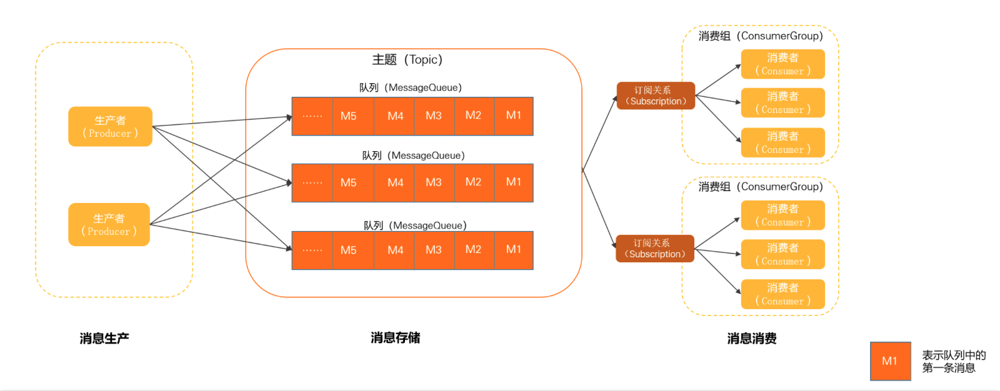
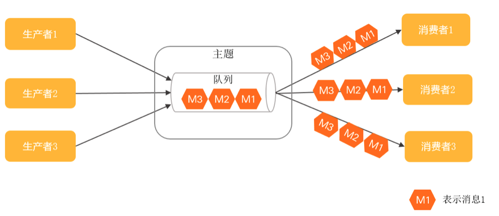

# 领域模型整体架构

中间件，使用异步通信，使用发送订阅的消息传输模型，**系统拓扑简单，上下游耦合较弱，主要用于异步解耦，流量削峰填谷**。
消息的生命周期分为三部分，消息生产、消息存储和消息消费，服务端接收生产后发送来的消息，消费者按照订阅主题消费信息。

## 各部分

- Producer（生产者）：产生消息，轻量级、匿名无身份的
- Topic（主题）：消息传输和存储实际的单元容器，消息存储和水平扩展通过其内队列实现
- MQ（消息队列）：消息传输和存储的实际单元容器，无限队列结构，顺序性存储
- Message（消息）：最小传输单元，有不可变性，初始化发送和完成存储后即不可变
- Consumer（消费者）： 消费消息的实体，一个消费者必属于某个消费者分组
- Consumer Group（消费组）：统一管理底层的多个消费者，同一个消费组的多个消费者必须保持消费逻辑和配置一致，共同分担该消费组订阅的消息，实现消费能力的水平扩展
- Subscription（订阅关系）：一个消费组一个订阅关系，消费组通过定义订阅关系控制指定消费组下的消费者如何实现消息过滤、消费重试及消费进度恢复等，除过滤以外都是持久化的，即服务端重启或断开请求，订阅关系依然保留

## 异步通信

各子系统之间无需强耦合直接连接，调用方只需要将请求转化成异步事件（消息）发送给中间代理，发送成功即可认为该异步链路调用完成，剩下的工作中间代理会负责将事件可靠通知到下游的调用系统，确保任务执行完成。该中间代理一般就是消息中间件。
优势如下：

- 系统拓扑简单：调用方和被调用方统一和中间代理通信，系统是星型结构，易于维护和管理
- 上下游耦合性弱：上下游系统之间弱耦合，结构更灵活，由中间代理负责缓冲和异步恢复，上下游系统间可以独立升级和变更，不会互相影响
- 容量削峰填谷：具备很强的流量缓冲和整形能力，业务流量高峰到来时不会击垮下游

## 发布订阅模型

主要特点是，消费方不是匿名的，有具体的身份，一般是订阅组（定义订阅关系），不同订阅组相互独立；同时可以一对多通信，同一个主题内的消息可以被多个消费组订阅，每个订阅组都可以拿到全量消息
